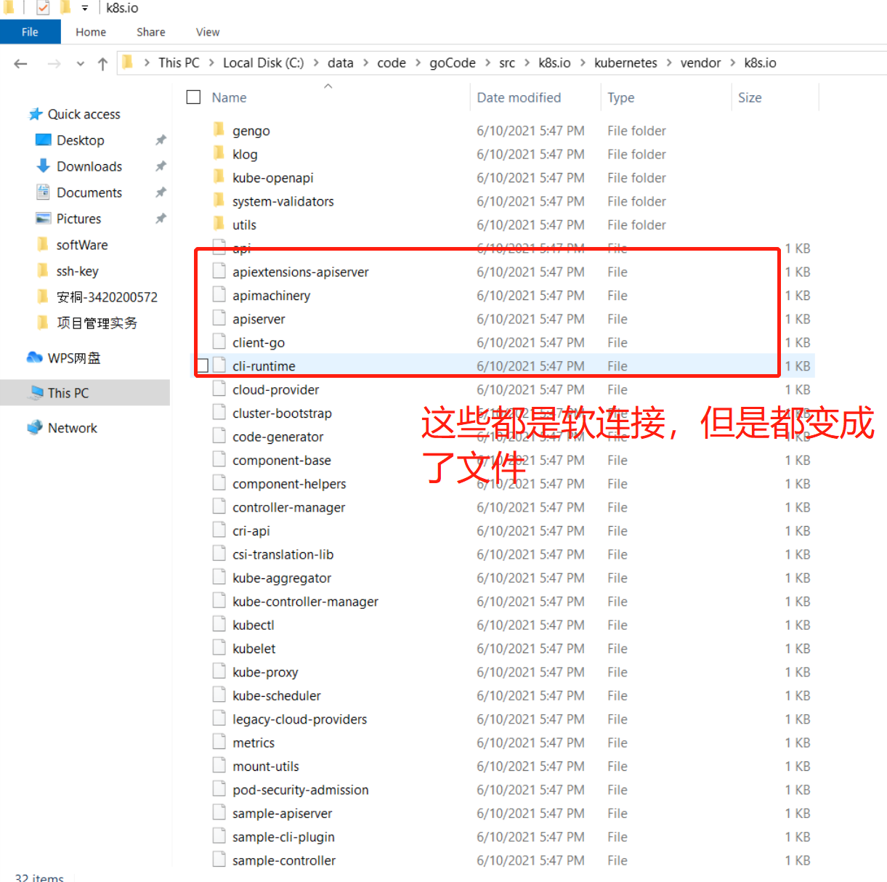
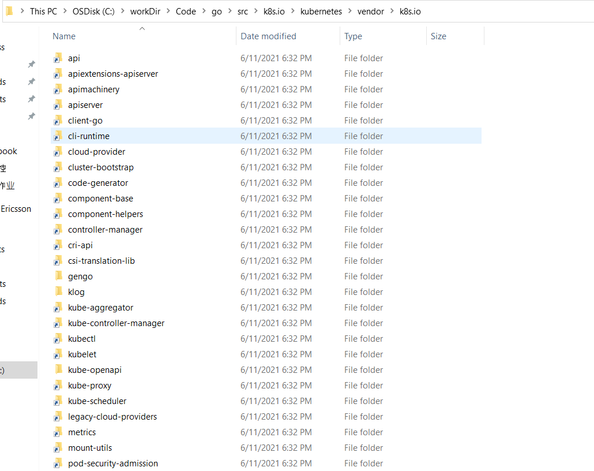

20210615 

**记录一个 windows 上下载和查看 k8s 源码遇到的一个问题：**

windows 上下载和查看k8s源码过程中，遇到引用的依赖包一直找不到，但是在 Linux 上编译时就不存在这个问题，有很大的困惑。

k8s源码中包管理方式是采用 Go Module 方式，应该寻找包时先找本地的 vendor 目录，其中一些依赖包是可以直接跳转到 vendor 中对应的包中，但是其中一些依赖包并不行。

慢慢搜索一些文章和查看 github 上 k8s 源码说明发现了一个现象，**`在 Linux 上的 k8s.io/kubernetes/vendor/k8s.io 中存在很多的软连接，这些软连接会跳转到 staging/src 目录下的代码里`**，软连接如下所示：

```shell
root@node-10-120-13-228:~/go/src/k8s.io/kubernetes/vendor/k8s.io# pwd
/root/go/src/k8s.io/kubernetes/vendor/k8s.io
root@node-10-120-13-228:~/go/src/k8s.io/kubernetes/vendor/k8s.io# ls -lrt
total 20
lrwxrwxrwx  1 root root   44 Jun 11 09:58 csi-translation-lib -> ../../staging/src/k8s.io/csi-translation-lib
lrwxrwxrwx  1 root root   32 Jun 11 09:58 cri-api -> ../../staging/src/k8s.io/cri-api
lrwxrwxrwx  1 root root   43 Jun 11 09:58 controller-manager -> ../../staging/src/k8s.io/controller-manager
lrwxrwxrwx  1 root root   42 Jun 11 09:58 component-helpers -> ../../staging/src/k8s.io/component-helpers
lrwxrwxrwx  1 root root   39 Jun 11 09:58 component-base -> ../../staging/src/k8s.io/component-base
lrwxrwxrwx  1 root root   39 Jun 11 09:58 code-generator -> ../../staging/src/k8s.io/code-generator
lrwxrwxrwx  1 root root   42 Jun 11 09:58 cluster-bootstrap -> ../../staging/src/k8s.io/cluster-bootstrap
lrwxrwxrwx  1 root root   39 Jun 11 09:58 cloud-provider -> ../../staging/src/k8s.io/cloud-provider
lrwxrwxrwx  1 root root   36 Jun 11 09:58 cli-runtime -> ../../staging/src/k8s.io/cli-runtime
lrwxrwxrwx  1 root root   34 Jun 11 09:58 client-go -> ../../staging/src/k8s.io/client-go
lrwxrwxrwx  1 root root   34 Jun 11 09:58 apiserver -> ../../staging/src/k8s.io/apiserver
lrwxrwxrwx  1 root root   37 Jun 11 09:58 apimachinery -> ../../staging/src/k8s.io/apimachinery
.......
```

k8s 对这部分软连接的解释如下：

# External Repository Staging Area

This directory is the staging area for packages that have been split to their own repository. The content here will be periodically published to respective top-level k8s.io repositories.

Repositories currently staged here:

- [`k8s.io/api`](https://github.com/kubernetes/api)
- [`k8s.io/apiextensions-apiserver`](https://github.com/kubernetes/apiextensions-apiserver)
- ...... 

而在 windows 上 git for windows在clone代码的时候，是默认不支持软连接的，如果直接使用 git clone下载，会把软连接下载成为包含软连接路径的一个文件，go是无法识别的。所以，这就造成一些依赖包没法找到。

k8s.io/kubernetes/vendor/k8s.io 目录下一些软连接 在windows 上失效截图如下：



**解决：**

git clone 时，使用 **管理员权限打开git bash**（因为windows中软连接建立需要使用管理员权限），操作如下：

```shell
C>: git clone -c core.symlinks=true git@github.com:kubernetes/kubernetes.git 
```

再次查看 k8s.io/kubernetes/vendor/k8s.io 目录下一些软连接 在windows 上情况：都变成了软连接形式



再次打开 Goland 查看k8s源码，加载完成后就不会再提示找不断依赖包问题。

